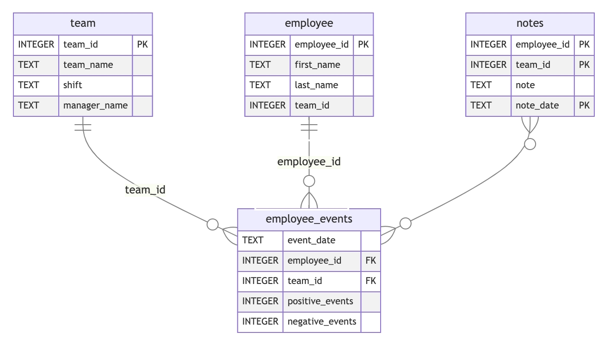

# Project Overview

## Business Scenario
- You are a data scientist for a manufacturing company.
- Your company's upper management have expressed concern about losing their best employees to competitors.
- To address this concern, the data team you're assigned to has done the following work:
A data entry form was deployed to managers that allows them to record an employee's positive and negative performance events
    - A database called employee_events has been created that stores the inputs from the manager form
    - A data scientist on your team has developed a machine learning model using data from this new database that predicts the likelihood of an employee being recruited by another company
- You have been assigned the following responsibility: **Build a dashboard that allows managers to monitor an employee's performance and their predicted risk of recruitment**. This dashboard must fulfill the following business requirements:
    - The dashboard visualizes the productivity of a single employee or a team of employees
    - The dashboard displays an employee's likelihood of recruitment, or a team of employees' average likelihood of recruitment

## Technical Scenario
1. Your company has more than one data science team, and each team works with different databases. To ensure business-critical datasets are tested and accessible to all data teams, each data team is required to publish Python APIs for the databases they work with. This means for the new database:

    - You must develop SQL queries that generate business-critical datasets.
    - You must develop a Python package that allows users to generate critical datasets without needing to write the queries themselves.
2. Your team has published previous dashboards using FastHTML. You are tasked with using your team's existing FastHTML codebase to develop your dashboard. This means:

    - You must familiarize yourself with the code your team has written and the repository structure used for storing the code.
    - You must use your knowledge of Object Oriented Programming to extend and customize pre-built Python classes.


# Repository Introduction

## Where to write your code
**Comments have been added to every code file to provide additional guidance. Replace the comment `#### YOUR CODE HERE` with your code**

There are three directories where all your code will be written

1. `python-package/`
2. `report/`
3. `tests/`

#### python-package/
This directory contains a `setup.py` file for building a Python package and a `employee_events/` subdirectory that contains all source code for the Python package.

**You will write code in every `.py` file in this subdirectory.**

#### report/
This directory contains all code files for building a FastHTML dashboard.

**You will write code in the following files within `report/`:**

1. dashboard.py
2. utils.py


#### tests/
This directory contains all Python tests for the Python package.

**You will write code in the `test_employee_events.py` file.**

#### Full directory structure


```
├── README.md
├── assets
│   ├── model.pkl
│   └── report.css
├── env
├── python-package
│   ├── employee_events
│   │   ├── __init__.py
│   │   ├── employee.py
│   │   ├── employee_events.db
│   │   ├── query_base.py
│   │   ├── sql_executor.py
│   │   └── team.py
│   ├── requirements.txt
│   └── setup.py
├── report
│   ├── base_components
│   │   ├── __init__.py
│   │   ├── base_component.py
│   │   └── data_table.py
│   ├── dashboard.py
│   └── utils.py
├── requirements.txt
├── start
└── tests
    └── test_employee_events.py
```


# Developer Guide

The **`report/src`** directory contains Python classes you will need to import and subclass for this project. Below is a developer guide for how this code is designed and how you can expect to use it:

## Important Code Rule
Generally speaking, all methods are required to have two positional parameters in addition to self

1. **entity_id** - The id for an employee or a team
2. **model** - An initialized class for executing SQL queries


## Getting Started
There are two base classes key to the code design for this project

1. `BaseComponent`

    - filepath: `/report/base_components/base_component.py`
2. `CombinedComponent`

    - `filepath: /report/combined_components/combined_component.py`

#### BaseComponent
This class handles the construction of simple HTML components and any data that is required to build a component. Here are a couple of examples of HTML components that use this class:

```
- A dropdown input field
- A data table with column names
```


***Most** code objects use BaseComponent as the parent class.*

**Project Polymorphism**
There are two primary methods where all subclass code is written

1. **build_component**

    - This method executes all code for constructing the html element and returns a single html object
    - When inheriting from BaseComponent, you are required to overwrite the build_component method.
2. **component_data**

    - This method manages SQL execution and returns the resulting data
    - This method only needs to be overwritten if the component requires data. `Dropdown` and `DataTable` are two base component objects that require data.

```
class BaseComponent:

    # 1 (Line 3 in base_component.py)
    def build_component(self, entity_id, model):
        raise NotImplementedError
                                  
    # 2 (Line 10 in base_component.py)                        
    def component_data(self, entity_id, model):
        raise NotImplementedError
```

#### CombinedComponent
This class is used as an engine for building HTML components that are made of multiple BaseComponent objects. The "engine" does the following:

1. Iterates over a list of HTML components
2. Builds each component object
3. Returns all built components inside an HTML div.

*This class is most commonly used to represent an entire HTML page sent to a user.*

```
class CombinedComponent:
\t  
    # The list of base components
    children = []

    def call_children(self, userid, model):

        called = []
        # 1 - Iterates over a list of components
        try:
            from fasthtml import FT  # Example import, adjust if FT is defined elsewhere or is a different type
        except ImportError:
            FT = None

        for child in self.children:
            # Check if the object is imported from fasthtml
            # because fasthtml objects do not
            # require an entity_id and model arguments
            if FT is not None and isinstance(child, FT):
                called.append(child())
            else:
                # 2 - Build the base component
                called.append(child(userid, model))
 
        return called              

    # 3 - Returns all built components inside an html div
    def outer_div(self, children, div_args):
        return Div(
            *children,
            **div_args
            )              
```

**Generally speaking, the only change required when subclassing `CombinedComponent` is setting the `children` attribute so it contains a list of initialized base_component and fasthtml objects. The objects should be sorted in the order they should appear in the rendered HTML.**


# Project Instructions
Below is a list of instructions for each project requirement. A checklist is provided at the bottom of this page to help you keep track of your progress.

**Your workspace for this project has Python and Git installed. You will need to install any dependencies you need for this project yourself.**

#### Define a Python mixin or decorator

Inside the `python-package/employee_events/sql_execution.py` file, you are asked to write either a python decorator or a python mixin. The mixin or decorator should be used to handle the following for all SQL queries

1. Opening a connection to the `python-package/employee_events/employee_events.db` SQLite database
2. Executing SQL queries using the open connection
3. Closing the connection to the database
4. Returning the data

**If you choose to use a decorator, the workflow should function something like this:**

```
@<decorator name>
def <function name>():
        return <sql query>
data = <function name>()
```

**If you choose to use a mixin, your mixin class should have methods for completing steps 1-4 above.**


#### Install Python package using `python-package/setup.py`
To install the Python package, navigate to the `python-package` directory and run the following command:
```
pip install -e .
```

This installs the package in editable mode, meaning any changes you make to the source files will be reflected immediately without needing to reinstall.

#### Define the `QueryBase` class and the subclasses `Employee` and `Team`
For each of these classes, you will write SQL queries that query the employee_events.db SQLite database

- Queries that can be used for both employees and teams should be placed inside the QueryBase class.
- Queries specific to an employee or a team should be placed in their respective class
**Below is an entity relationship diagram of employee_events.db to help you write your queries**




#### Install Python package
Using the command line, build and install the `employee_events` python package.

#### Set project paths
In the `report/utils.py` and `tests/test_employee_events.py` files you are required to create pathlib variables that point to certain locations of the project.

- The `report/utils.py` file contains a function for unpickling a machine learning model. In this file, you are required to create two pathlib variables that point to the root of the project and the `model.pkl` file.
- The `tests/test_employee_events.py` file requires a path for interacting with the SLQite database.

#### Import classes from the Python package,`report/utils.py`, and `report/src/` into `dashboard.py`
- Once you have successfully built and installed the **employee_events** python package, you will import the package's classes into the **report/dashboard.py** file.

- You will also need to import classes from **report/src/**

- *Comments are provided to help you with these imports*


#### Define dashboard subclasses
To develop the HTML for the dashboard, you will need to use Python inheritance to subclass pre-built classes inside `report/src/`.

#### Initialize FastHTML app and define routes
- Initialize a FastHTML application object
- Define the `index`, `employee`, and `team` routes

#### Define 5 test functions using pytest
Inside the `tests/test_employee_events.py` file, define the following functions to be utilized by pytest

- `db_path`
- `test_db_exists`
- `test_employee_table_exists`
- `test_team_table_exists`
- `test_employee_events_table_exists`


## Task List

- [ ] Define a Python mixin or decorator
- [ ] Define the `QueryBase` class and the subclasses `Employee` and `Team`
- [ ] Install Python package using `python-package/setup.py`
- [ ] Set project paths
- [ ] Import classes from the python package, `report/utils.py`, and `report/src/` into `dashboard.py`
- [ ] Define dashboard subclasses
- [ ] Initialize FastHTML app and define routes
- [ ] Define 5 test functions using `pytest`


# Project Rubric
Use this project rubric to understand and assess the project criteria.

## Python Package

| Criteria | Submission Requirements |
| --- | --- |
| Build a Python package that is installed into your project environment | • `.tar.gz` file exists in `python-package/dist/`<br>• The Python package opens a connection to the `employee_events.db` SQLite database<br>• The Python package executes successful SQL queries<br>• The code is imported from the installed package inside `dashboard.py` |

## Dashboard Development

| Criteria | Submission Requirements |
| --- | --- |
| Build a simple data dashboard | <ul><li>`dashboard.py` runs without error</li><li>The dashboard application displays employee_events.db data</li><li>The dashboard application includes two data visualizations</li></ul> |

## Object Oriented Programming

| Criteria | Submission Requirements |
| --- | --- |
| Define Python classes that utilize inheritance | <ul><li>Python classes are defined without code erroring out</li><li>Python classes are initialized without code erroring out</li><li>Inheritance is used to pass methods and attributes to subclasses, and to avoid redundancy in code</li><li>A mixin class is defined without error and without unnecessary methods</li><li>A mixin class is included in an inheritance tree only when necessary</li></ul> |


## Github Repository

| Criteria | Submission Requirements |
| --- | --- |
| Publish a professional GitHub repository | <ul><li>No unnecessary files are preset in the repository</li><li>All Python package and dashboard code is present in the repository</li><li>A GitHub action triggers tests when a new commit is pushed</li><li>Code environment is documented and reproducible</li></ul> |

## Suggestions to Make Your Project Stand Out

- A color scale is applied to the machine learning visualization
- The title of the dashboard updates to "Employee Performance" or "Team Performance" based on filter settings